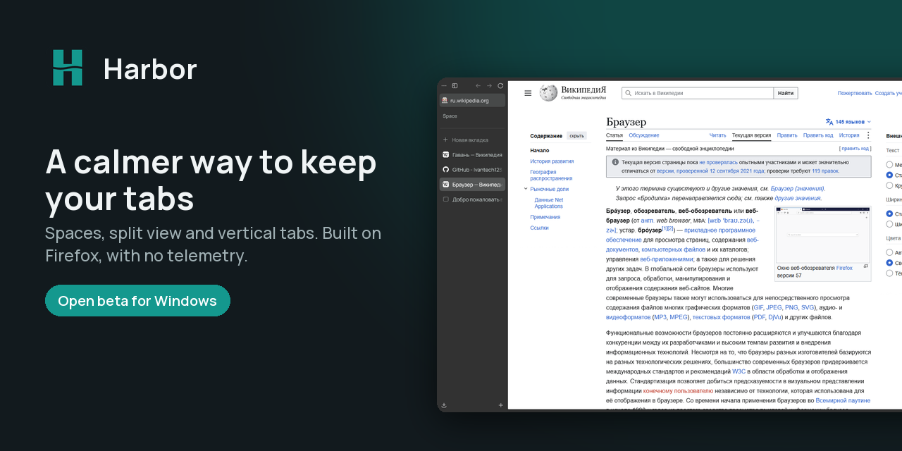
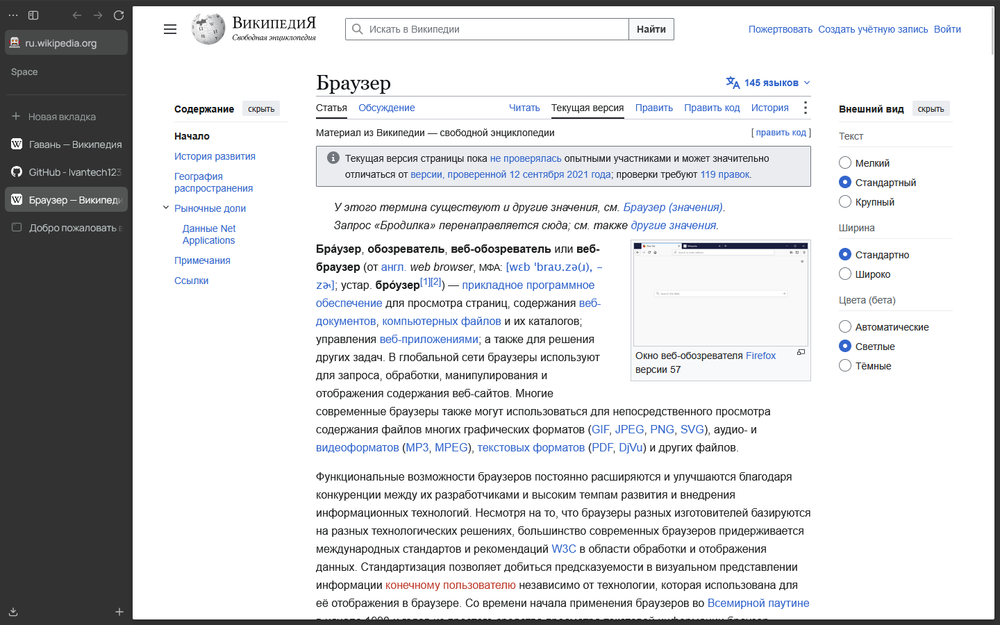
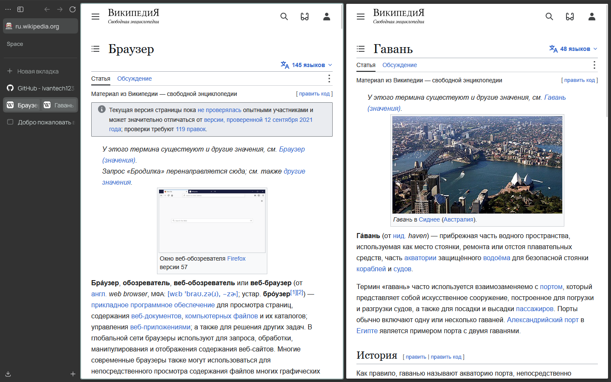
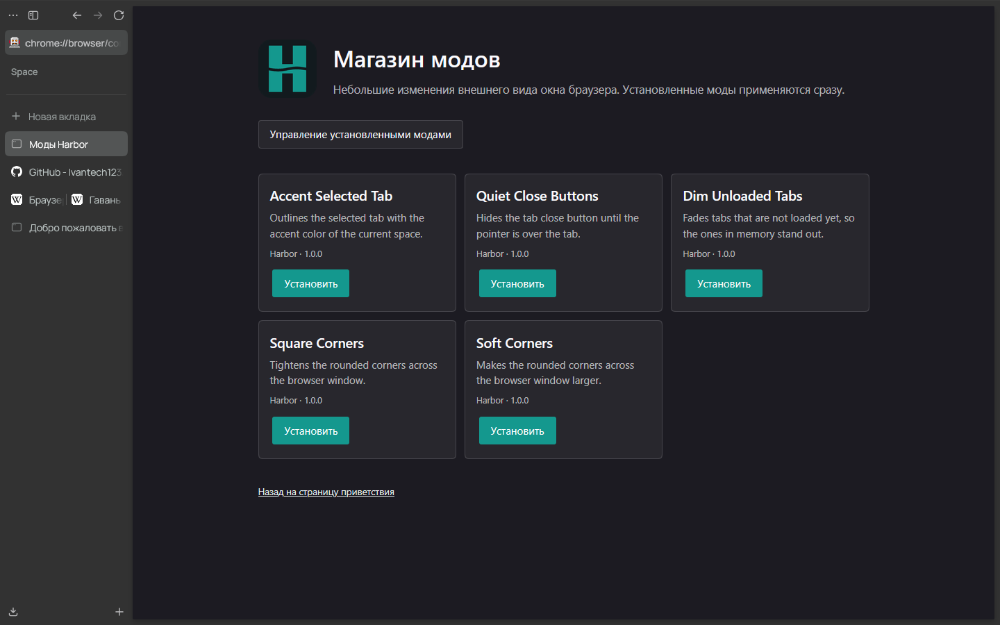
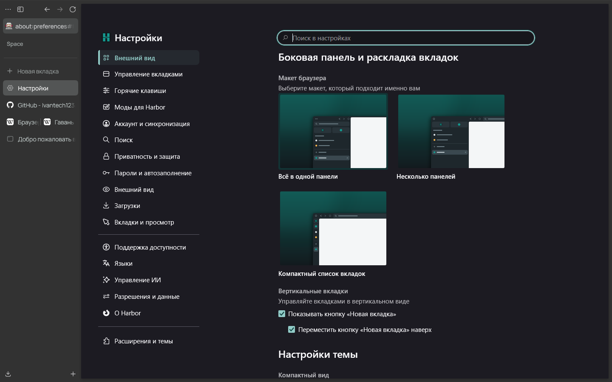
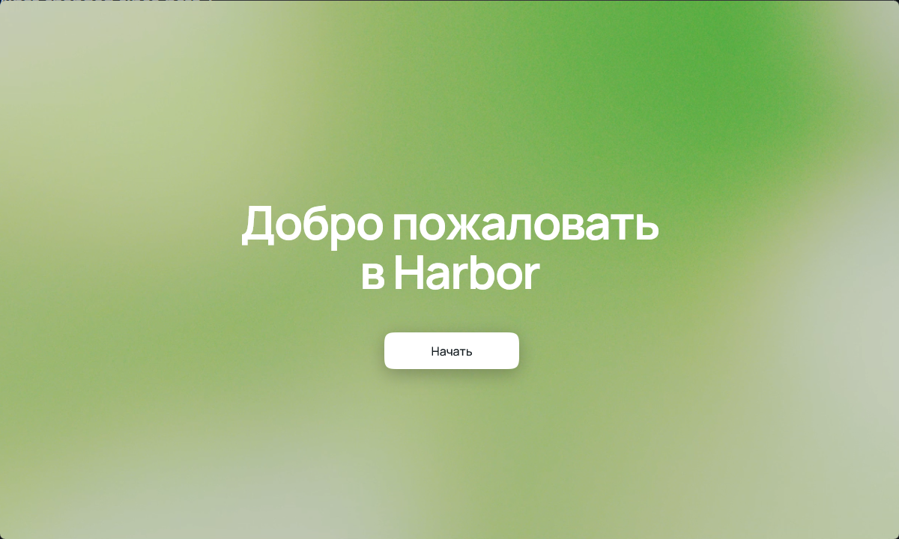
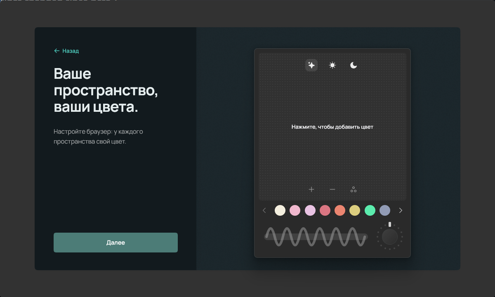

<!--
   - This Source Code Form is subject to the terms of the Mozilla Public
   - License, v. 2.0. If a copy of the MPL was not distributed with this
   - file, You can obtain one at http://mozilla.org/MPL/2.0/.
   -->

### `Harbor`

**Harbor** is an independent Firefox-based browser with innovative UI features, including custom spaces, split-view browsing, and advanced customization options.

  <a href="https://github.com/Ivantech123/Harbor/releases/latest">
    Download
  </a>
  •
  <a href="https://github.com/Ivantech123/Harbor/releases">
    Release Notes
  </a>
  •
  <a href="./docs/contribute.md">
    Contributing
  </a>

### Screenshots

| | |
| --- | --- |
|  |  |
|  |  |
|  |  |

### Firefox Versions

- [`Release`](https://github.com/Ivantech123/Harbor/releases/latest) - Built using Firefox version `156.0.1`
- [`Twilight`](https://github.com/Ivantech123/Harbor/releases) - Built using Firefox version `RC 156.0.1` (testing channel)

### Contributing

If you'd like to report a bug, please use our [GitHub Issues page](https://github.com/Ivantech123/Harbor/issues/). For feature requests and discussions, visit [GitHub Discussions](https://github.com/Ivantech123/Harbor/discussions).

Harbor is an open-source project, and we welcome contributions from the community! Please review the [contribution guidelines](./docs/contribute.md) before getting started.
